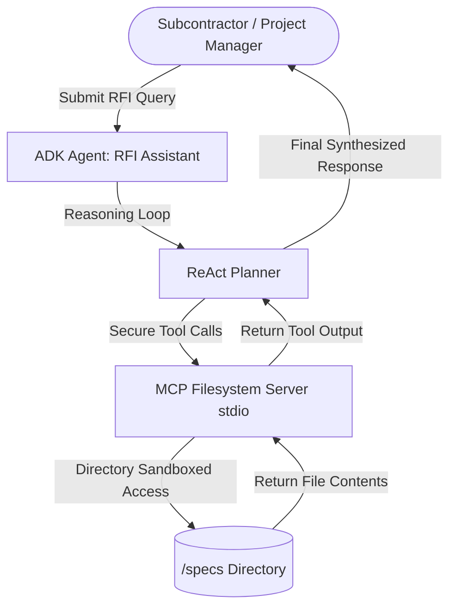

# 🏗️ Subcontractor RFI & Submittal Assistant

An autonomous AI Agent designed for construction project management, powered by **Google's Agent Development Kit (ADK)** and the **Model Context Protocol (MCP)**. This agent automates the retrieval, verification, and drafting of responses to subcontractor Requests for Information (RFIs) by securely querying building specification documents.

Target Track: **Agents for Business** (or **Freestyle**)

---

## 📖 The Problem & Solution

### The Problem
During construction, subcontractors frequently submit Requests for Information (RFIs) regarding concrete strength, structural alignment, electrical fittings, safety codes, and material specifications. Project Managers (PMs) spend hours digging through thousands of pages of project specifications and drawings to find the answers, leading to project delays, high admin overhead, and potential compliance issues if incorrect data is referenced.

### The Solution
The **RFI Assistant** is an intelligent agent that:
1.  **Ingests subcontractor questions** through a conversational interface (local playground or API).
2.  **Autonomous Specifications Retrieval**: Uses an **MCP Filesystem Server** to locate and read relevant PDF/Markdown specification sheets.
3.  **Precise Drafting**: Extracts specifications, verifies values, and drafts a professional response citing the exact section, part, and paragraph (e.g., *Section 03 30 00, Part 3.1*), eliminating human errors and speeding up administrative approvals.

---

## 🛠️ Key Concepts Applied (Course Alignment)

This project implements three core concepts from **Kaggle's Intensive Vibe Coding Course**:
*   **Agent / Multi-agent system (ADK)**: Built using the Google ADK Python SDK. The agent runs a ReAct reasoning loop to dynamically list directories, search files, read relevant sections, and compile responses.
*   **MCP Server (Model Context Protocol)**: Uses the official `@modelcontextprotocol/server-filesystem` via stdio parameters.
*   **Security features**:
    *   **Directory Sandboxing**: The MCP Filesystem server is strictly constrained to the `specs/` folder in the project root. The agent cannot read, write, or access files outside this directory (preventing prompt injections or malicious file system tampering).
    *   **No Hardcoded Secrets**: Uses environment variables for API key configuration.
*   **Deployability**: Deployed locally with the `agents-cli playground` and ready for cloud deployment on **Google Cloud Agent Runtime** or **Cloud Run**.

---

## 📐 System Architecture



---

## 📂 Project Structure

```
rfi-assistant/
├── app/                      # Core agent code
│   ├── __init__.py           
│   └── agent.py              # Agent, Model, and MCP integration setup
├── specs/                    # Project Specification Files (Sandboxed)
│   ├── spec_03_30_00_cast_in_place_concrete.md
│   ├── spec_05_12_00_structural_steel_framing.md
│   └── spec_26_05_00_electrical_specifications.md
├── tests/                    # Tests directory
├── pyproject.toml            # Project dependencies and configuration
└── README.md                 # Project documentation (this file)
```

---

## 🚀 Getting Started

### Prerequisites
*   [uv](https://docs.astral.sh/uv/getting-started/installation/): A fast Python package installer and manager.
*   [Node.js (npx)](https://nodejs.org/): Required to run the MCP filesystem server.
*   [Google Cloud SDK](https://cloud.google.com/sdk/docs/install): Authenticated with your Google Cloud account.

### 1. Installation
Clone the repository and install dependencies using `agents-cli`:
```bash
# Install the Agents CLI globally
uv tool install google-agents-cli

# Install local dependencies and set up the virtual environment
agents-cli install
```

### 2. Authentication
Ensure you are logged into your Google Cloud account and have a default project configured:
```bash
gcloud auth application-default login
gcloud config set project <your-gcp-project-id>
```

### 3. Local Development & Testing
Run a quick command-line smoke test:
```bash
agents-cli run "What is the minimum compressive strength for foundation footings?"
```

Start the interactive Web Playground to chat with the agent in real time:
```bash
agents-cli playground
```
This will spin up a local FastAPI server and open a web-based chat interface in your browser.

---

## 📝 Example Interaction Trace

**User Query:**
> *"What are the temperature limits for placing concrete in cold weather?"*

**Agent Execution Traces:**
1.  **Tool Call**: `list_directory(path="specs")`
    *   **Response**: `spec_03_30_00_cast_in_place_concrete.md`, `spec_05_12_00_structural_steel_framing.md`, `spec_26_05_00_electrical_specifications.md`
2.  **Tool Call**: `read_text_file(path="specs/spec_03_30_00_cast_in_place_concrete.md")`
    *   **Response**: Retrieves full concrete specs including Part 3.1: Cold Weather Concrete Placement.
3.  **Final Response**:
    > "The temperature limits for placing concrete in cold weather are specified in Section 03 30 00.
    > 
    > Per **Section 03 30 00 - Cast-in-Place Concrete, Part 3.1**, cold weather procedures must be implemented when ambient temperature falls below **40°F (4.4°C)**.
    > *   Concrete temperature at placement must be maintained between **55°F (13°C)** and **80°F (27°C)**.
    > *   Heating and protection must maintain concrete at a minimum of **50°F (10°C)** for at least **72 hours** post-placement."
